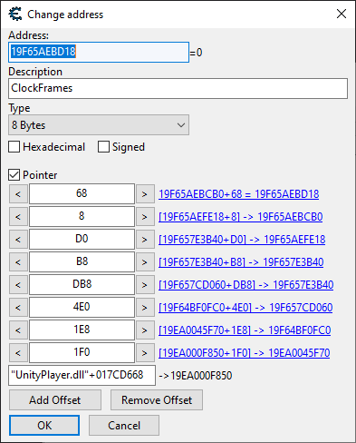

# Get started using MindControl 

> **DO NOT use this library to cheat in online competitive games. Cheaters ruins the fun for everyone. If you ignore this warning, I will do my best to shut down your project.**

This documentation aims to provide you with basic directions on how to get started hacking a process with the MindControl library.

## Basic principle

Let's go through the basics of hacking a health value in an imaginary game.

```csharp
// Open a process named "mygame" that is currently running
var myGame = ProcessMemory.OpenProcess("mygame");

// Build a path that points to the health value or anything else you want to hack
// To determine these, use tools like Cheat Engine (keep reading the docs for more info)
var hpAddress = new PointerPath("mygame.exe+1D005A70,1C,8");

// Read the health value. In this example, it's an integer, but it can be any basic type.
int currentHp = myGame.ReadInt(hpAddress);
Console.WriteLine($"You have {currentHp}HP"); // Example output: "You have 50HP"

// Overwrite the health value of the game so that our health goes to 9999.
myGame.WriteInt(hpAddress, 9999);
```

This code should give you an idea of how the library works and how to build basic hacks.

## Figuring out pointer paths

The key in the example shown above is the pointer path, that allows us to reference the address of the health value in the internal memory of our imaginary game.

The pointer path to use will be different for each case, and also need to be stable in order to work every time. To figure out those stable pointers, you will need to experiment with tools such as [Cheat Engine](https://www.cheatengine.org), or use pointers that others have figured out through this process.

This documentation will not go through the process of finding stable pointer paths. Cheat Engine has tutorials, and there are lots of video resources out there that you can check out.

Once you've figured out your stable pointer, just transcribe it into the PointerPath expression syntax and you're ready to hack! Here's a quick example of transcribing a pointer from Cheat Engine:



Just go from the bottom up, and separate every field with a `,`.

The result: `"UnityPlayer.dll"+017CD668,1F0,1E8,4E0,DB8,B8,D0,8,68`.

Stable pointers usually start with a module name, in this case `"UnityPlayer.dll"`, but you don't have to use one. Check out the [pointer path doc](PointerPath.md) if you need more info.

## Gotchas and common pitfalls

Hacking is hard and comes with a lot of surprises and hurdles. Take your time, make sure you understand what you're doing, and you'll get there eventually.

Here are common reasons for your programs to fail:
- Your hacking program may need to be run as an administrator. This can be required to manipulate memory, disable protections, and other internal operations that MindControl does.
- You are getting/setting wrong values because your pointer path is not stable. Double-check with Cheat Engine that your pointer does work in the same circumstances.
- You cannot read string properly. Check out the [Manipulating strings](ManipulatingStrings.md) documentation.

## Finding patterns in memory

MindControl allows you to search for byte patterns in the memory of your target process. This can be useful to find the location of a value you want to hack, or to find a function you want to hook.

```csharp
var myGame = ProcessMemory.OpenProcess("mygame");
UIntPtr targetAddress = myGame.FindBytes("4D 79 ?? ?? ?? ?? ?? ?? 56 61 6C 75 65")
    .FirstOrDefault();
```

Find out more about this on the [FindBytes](FindBytes.md) documentation.

## Handle process exit and restart

The `ProcessMemory` class has a `ProcessDetached` event that you can use to react to your target process exiting or crashing. Note that it will also fire when disposing the instance.

```csharp
var myGame = ProcessMemory.OpenProcess("mygame");
myGame.ProcessDetached += (_, _) => { Console.WriteLine("Target process is detached."); }
```

However, a `ProcessMemory` instance that has been detached **cannot be reattached**.

If you want to handle your target process exiting and potentially restarting (or starting after your hacking program), use the `ProcessTracker` class.

```csharp
var tracker = new ProcessTracker("mygame");
tracker.Attached += (_, _) => { Console.WriteLine("Target is attached."); }
tracker.Detached += (_, _) => { Console.WriteLine("Target is detached."); }

var myGame = tracker.GetProcessMemory();
```

The `GetProcessMemory` method will return an attached `ProcessMemory` instance, or null if the target process is not running. It will automatically handle target process restarts by creating a new `ProcessMemory` instance when the existing one has been detached.

Just make sure to use the freshest instance from the tracker in your reading/writing methods, and not a stored `ProcessMemory` variable:

```csharp
public MyHackingClass()
{
    Tracker = new ProcessTracker("mygame");
}
public void Update()
    => DoSomeHacking(Tracker.GetProcessMemory()); // ✓ This will handle restarts
```

VS

```csharp
public MyHackingClass()
{
    var tracker = new ProcessTracker("mygame");
    MyGame = tracker.GetProcessMemory();
}
public void Update()
    => DoSomeHacking(MyGame); // ✖ This will NOT handle restarts.
```

## Inject libraries

MindControl allows you to inject DLLs into the target process, which can be used to execute arbitrary code in the target process.

```csharp
var myGame = ProcessMemory.OpenProcess("mygame");
myGame.InjectLibrary("myhack.dll");
```

For example, you can use named pipes to communicate between your hacking program and the target process (send commands to the game or receive data from it).

## Tracking a process in real-time

The `StateWatcher` class gives you a convenient way to access the internal data of your target process, with automatic refreshes.

Check the [StateWatcher](StateWatcher.md) documentation to learn how to set it up.
