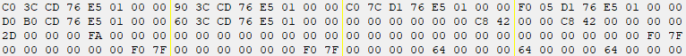
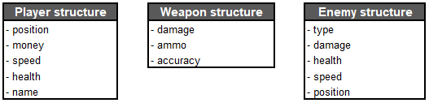
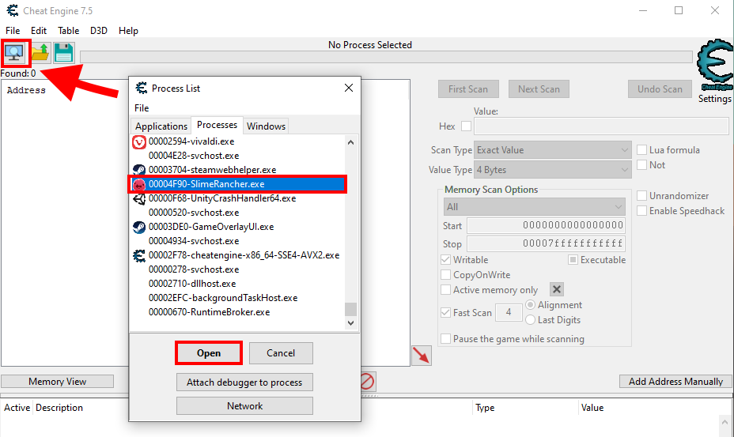
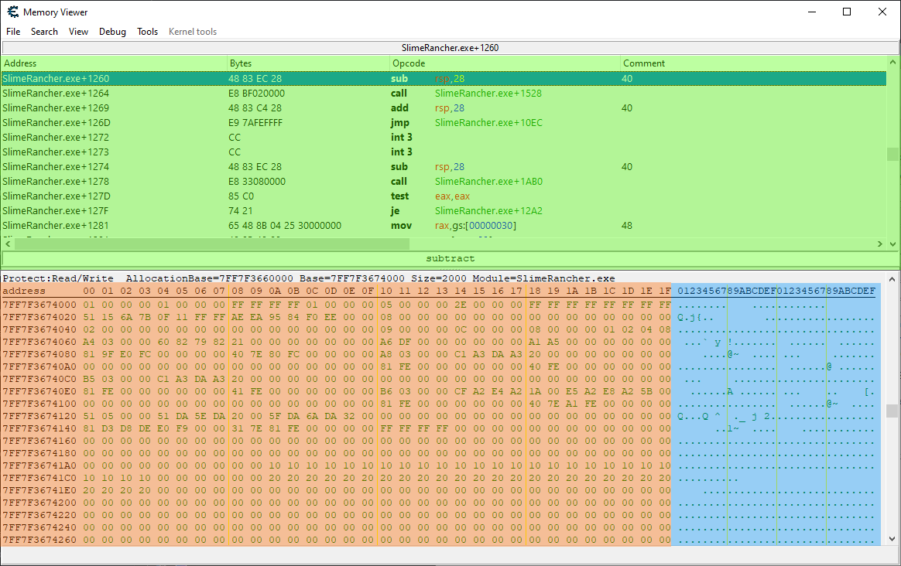
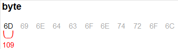

# Basic memory concepts

This section is intended to cover some fundamental concepts about memory hacking. If you are already familiar with memory hacking, you can skip ahead to the [Project setup](#todo) section.

## Memory and structures

As previously stated, a program is loaded into memory when it runs. This means that all the data it needs to operate is stored in memory, as a series of numeric values. These numeric values can be just numbers, like a character's health points value, but when grouped together, they can be text, pictures, audio, code instructions, or anything else. The way the data is organized is defined by how the program is written and compiled.

 
*An example of a small portion of memory shown in a memory viewer.*

A structure is a set of related variables that are grouped together in a set. Each variable in the structure is called a member. Structures can be nested, meaning that a member of a structure can be another structure. If you think about it in terms of object-oriented programming, a structure is like a class, and a member is like a field.

To give a few examples, in a game, you could have a structure that represents the player's character. This structure could have members for the player's health, position, speed, and so on. You could imagine other structures that represent the game world, weapons, enemies, animations, etc.

 
*An extremely simplified example of structures in a game. This is not an accurate representation of any game, just an example.*

All the structures that are relevant to the state of the game are stored in memory, and the game itself uses that memory to operate. If we manage to identify these values, we can observe and manipulate them. For example, if you were to change the player's health value, you would see the player's health bar change instantly (in most cases). Unless it specifically has cheat protection, the game would have no clue that you changed the value, as it would just read the health value from memory like it does at every frame to update the health bar accordingly.

The trouble is that **we don't know** where in memory these structures are stored, how they are arranged, and most often, what structures are defined. This is where tools like Cheat Engine come in handy.

## Attaching to the process with Cheat Engine

If we start the Slime Rancher demo, and then open Cheat Engine, we can attach Cheat Engine to the game process. This will allow us to inspect the memory of the game.

 
*Attaching Cheat Engine to the game process: click the "Select a process to open" button in the top-left action icon row, and then pick the process running the game.*

> [!NOTE]
> This is not the case for Slime Rancher, but sometimes, your target can have multiple processes. The correct one to pick is usually the one with the highest memory usage (check in the Task Manager). You can also use the "Windows" tab in the Cheat Engine process list to find the process handling the main window, which is the correct one in most cases.

## Memory viewer and addresses

Clicking the "Memory View" button above the bottom panel will open the memory viewer window. This window allows you to visualize both the memory and the decoded instructions of the game code.

 
*The Memory viewer window: The top-most panel, highlighted in green, shows the disassembled (decoded) instructions of the game code. The bottom panel, highlighted in orange and blue, shows the memory contents.*

Let's focus on the left part of the memory viewer panel for now (the part highlighted in orange in the screenshot shown above). It shows the memory as a series of hexadecimal numbers that range from 00 to FF (255). And as you can see, there are lots and lots of these numbers. You can keep scrolling pretty much forever. This is because each of these numbers is a byte, and this game, like most 3D games, has well over a gigabyte of memory, which means over a billion bytes.

On the leftmost part of the panel, you will notice hexadecimal numbers ranging from 00000000 to 7FFFFFFF. These are the **memory addresses**. Each byte in memory has an address. If we think of the process memory as an immense locker room, the memory addresses are the locker numbers, and the bytes are what we store in the lockers. The address on the left of the panel is the address of the leftmost byte in the matching row. If you select a byte by clicking on it, you will see the address of that byte in the bottom-left corner of the window.

Memory addresses are a key concept in memory hacking. Whenever we want to read or write to a specific memory location, we need to know its address. This is why memory hacking tools like Cheat Engine will always show the addresses of everything you inspect.

## Values and types

So, each byte that you can see in the memory viewer represents a value between 0 and 255. But what if we want to store a bigger number, like 123456? We can't do that with a single byte.

Well, if you group multiple adjacent bytes together, you can store bigger numbers. For example, if you group four bytes together, you can store a number between 0 and 4294967295.

This notion of grouping bytes together to store more than just a small value is called a **data type**. A data type is a way to define how many bytes are used to store a value, and how that value is interpreted. For example, a short integer is a data type that uses two bytes to store a whole number. A floating-point number (or "float") is a data type that uses four bytes to store a decimal number. A string is a data type that uses multiple bytes to store a sequence of characters that form a text.

 
*An illustration showing the same bytes interpreted into different types.*

If you select a byte in the memory viewer, below the memory panel, Cheat Engine will display the base-10 value of the byte, but also its value when grouped together with the following bytes, interpreted as some of the most used data types. This is useful when trying to understand if the byte is the start of a field with a bigger type.

## Next step

Now that we have covered some basic memory concepts, the next section will be about searching for specific values in memory using Cheat Engine.
