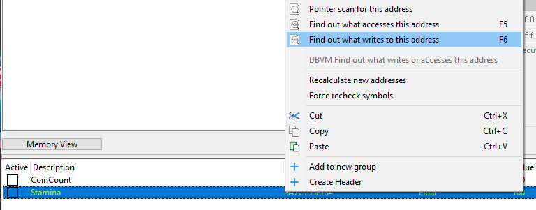
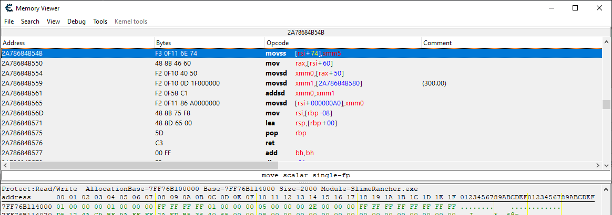
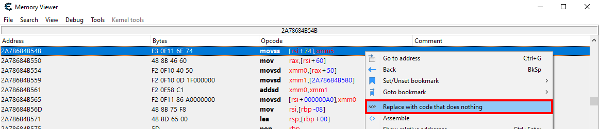
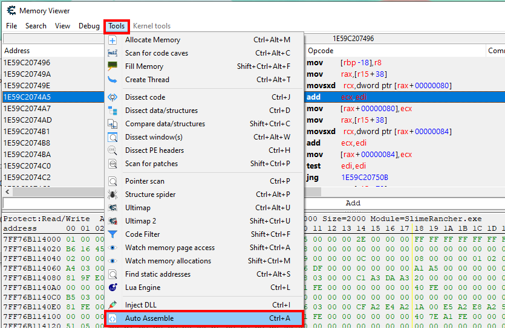
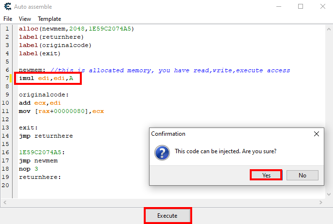

# Code manipulation

In this section, we are going to manipulate the code instructions of our target program. This is a slightly more advanced topic, but we will keep things simple.

## Code instructions in memory

As stated in the previous section, a program is loaded into memory when it runs. This means that the code that the program executes is stored in memory, as a series of instructions.

We have seen before that these Assembly instructions are represented with a short mnemonic, followed by a list of operands. For example, the instruction `MOV EAX, 0x12345678` moves the value `0x12345678` into the `EAX` register.

But these instructions are not stored as text in memory. They are stored as binary values, where each value represents a different instruction. The CPU reads these values and executes the corresponding instruction. These numeric values are called **opcodes**.

For example, the `ADD EAX, 0x11BB22CC` instruction, which means "add the value `0x11BB22CC` to the `EAX` register",  is written as `05 CC 22 BB 11` in memory. The `05` opcode tells the CPU that this is an `ADD` instruction with `EAX` as the first operand, and the following bytes are the value, in little-endian (in reverse).

This means that, if we rewrite instructions in the memory of a running process, we can change the behavior of the program.

## Locating code instructions

Even when you know assembly, reading and understanding the whole code of a program would take ages, because there are lots of instructions, which are all very basic, and not very informative by themselves. So, if we want to modify parts of the code, we need to know where to look.

Let's take a quick example. In the Slime Rancher demo, running uses up your stamina, and so you cannot run forever. The first thing that we are going to do is to modify the behaviour of the game so that running does not consume stamina anymore. To do that, we need to find the code that decreases the stamina value when running. But we don't know what this code looks like (what registers it uses, what values it compares, etc.).

To find this code, we first need to find out the address of the stamina value in memory. We've already covered how to do so in the "[Finding values with Cheat Engine](./finding-values.md)" section of this guide. Here are some more hints:
- Like most values that are displayed in gauges or bars in games, the stamina value is a float
- You can sprint and then pause the game to freeze the value while you are scanning for it
- The number you see in-game is rounded, so it's better to use the `Value between...` scan type instead of exact values. For example, if you see 72, search for values between 71 and 73.

> **Remark**: Once you have found the stamina value, notice how it relates to the coin count. They are very close together. It's likely that they are part of the same structure. You can even duplicate the coin count pointer path and replace the `+80` offset with a `+74` offset to get a stable pointer path to the stamina value.

> [!TIP]
> If you cannot find the stamina value and still want to go further, just subtract 0xC from the coin count address.

Once we have the address of the stamina value, we are going to use a tool that we've already covered before: the "Find out what writes to this address" feature of Cheat Engine. This feature will show us the code that writes to the stamina value in memory. This is likely to lead to the code that decreases the stamina value when running.

<br/>

This opens a window you should already be familiar with, showing the instructions that write to the stamina address. If you go back to the game, without even sprinting, you should see an instruction being called over and over again (probably each frame). This should be `movss [rax+74],xmm5`. However, we will disregard this instruction, because, when we start sprinting, we see another entry appear in the list. Because that second one only appears when we sprint, we can suppose that it's the instruction that decreases the stamina value when you are sprinting, and so that's the one we are looking for.

So that second instruction should be `movss [rsi+74],xmm5`. Select this one and click the "Show disassembler" button. This will open the memory view window and show you the disassembled code around this instruction.

<br/>
*The first line highlighted in blue is the instruction that writes to the stamina address. The next lines are the instructions that are executed afterward.*

## Removing code instructions

Now that we have located the instruction, let's try modifying it. Our goal is to prevent stamina from decreasing. In theory, this can be done by just removing the instruction that writes to the stamina value. If nothing writes there, stamina won't go down.

In practice, the convenient way to do that is to replace the target instruction with `NOP` instructions. `NOP` is an assembly instruction that does nothing. It's just a placeholder that takes up space in the code. Its bytecode is `0x90`, so it only takes up one byte. To fully replace our instruction, we need to replace the 5 bytes taken by the original `movss` instruction with 5 `NOP` instructions.

This procedure is actually pretty common, and thus Cheat Engine has a tool for it. Just right-click the instruction you want to replace, and select "Replace with code that does nothing".

<br/>
*Once you click "Replace with code that does nothing", you should see five NOP instructions instead of the original `movss` instruction.*

Now, go back to the game and start sprinting. You should see that your stamina does not decrease anymore, and you can sprint forever. Congratulations, you've successfully manipulated the code of the game!

## Injecting code instructions

Deactivating instructions was simple enough. But let's say that instead of disabling a behaviour, we want to modify something. For example, let's say we want to multiply the coins we gain by selling plorts by 10. This is a more complex scenario, because we need to add instructions instead of just removing them.

The problem with adding new instructions is that we cannot insert them in the middle of the code. The code is already written in memory, and we cannot just shift it around. If we were to overwrite the existing opcodes, we would write over the next instructions, and the program would probably crash.

The best way to insert code is through a **trampoline hook**, which, as dumb as it sounds, actually makes sense when you know how it works. The idea is to:
- Write the new instructions in an unused memory location
- Replace the target instruction with a `JMP` instruction that jumps (redirects) to the new instructions
- At the end of the new instructions, add a `JMP` instruction that jumps back to the original code

This normally involves a lot of work (finding or allocating a memory location, writing the new instructions, writing the trampoline with instructions that depend on the distance to the new code, etc.), but Cheat Engine has a tool that simplifies this process.

For now, let's find the instruction that adds the coins when selling plorts, using the same technique as before: use "Find out what writes to this address" on the coin count address (because we now have a pointer path, Cheat Engine will ask if we want to use the pointer or the address. Pick the "Find what writes the address pointed at by this pointer" option), and look for the instruction that writes to the coin count when you sell plorts.

The instruction should be `mov [rax+80],ecx`. It writes the value of the `ecx` register to the coin count address. This means that `ecx` holds the new coin count value. If we use the "Show disassembler" button, we should see the instructions around this one. The previous instruction in particular is `add ecx,edi`, which adds the value of the `edi` register to the `ecx` register. This is the instruction that adds the coins when selling plorts.

When reaching the `add` instruction, the `edi` register should hold the value of the plort price. This is the value that we want to multiply by 10. So, we need to insert an instruction that multiplies the `edi` register by 10 before the `add` instruction.

To perform the code injection in Cheat Engine, select the `add` instruction, and then in the Tools menu, pick "Auto Assemble".

<br/>

This will open a window where you can write the new instructions. In that new window, in the "Template" menu, pick "Code injection". This will fill the window with the necessary code to perform the injection. You should see something like this:

```
alloc(newmem,2048,1E59C2074A5) 
label(returnhere)
label(originalcode)
label(exit)

newmem: //this is allocated memory, you have read,write,execute access
//place your code here

originalcode:
add ecx,edi
mov [rax+00000080],ecx

exit:
jmp returnhere

1E59C2074A5:
jmp newmem
nop 3
returnhere:
```

> [!NOTE]
> The addresses may be different in your case.

This code does exactly what we explained before. It allocates a new memory location, writes the new instructions there, and then replaces the target instruction with a `JMP` instruction that jumps to the new instructions. At the end of the new instructions, there is a `JMP` instruction that jumps back to the original code.

Now, we need to modify the `newmem` block to multiply the `edi` register by 10. The instruction to do that is `imul edi,edi,A` (meaning: multiply `edi` by A (or 10 in base-10) and place the result in `edi`). So, replace the `//place your code here` comment with this instruction, and click on Execute.

<br/>

Once you've done that, Cheat Engine will ask you if you want to see the new code in the memory viewer. Click "Yes", and you should see the new instructions in memory.

You should have 4 instructions:
```assembly
imul edi,edi,0A
add ecx,edi
mov [rax+80],ecx
jmp 1E59C2074AD
```

> The jmp instruction at the end is the one that jumps back to the original code. The exact address may be different in your case.

You should also see a bunch of `add [rax],al` after the `jmp` instruction, but these are just there because the new memory location is filled with 0 bytes by default, and `00 00` can be interpreted as an `add` instruction. They are never executed, because the `jmp` instruction jumps back to the original code.

If you highlight the `jmp` instruction and press Spacebar, the memory viewer will "follow" the jump and go to the original code. Scroll a little bit up, and you will see that the original `add ecx,edi` and the following `mov [rax+80],ecx` instructions have been replaced with a `jmp` instruction that jumps to the new code, and a `nop` instruction that does nothing and is only there for padding, to make sure the next instructions are aligned correctly, just like they were before.

Note that the `add` and `mov` instructions that were replaced by the new `jmp` are now in the new memory location after our `imul` instruction. They have been automatically moved there by Cheat Engine to make room for the `jmp` instruction in the original code location.

Now, go back to the game and try to sell a plort. It should give you 10 times more coins than displayed on the market panel. Congratulations, you've successfully injected code into the game!

## Next part

This is the end of the "hacking basics" tutorial part of this guide. The next chapter will now cover how to make programs that use the MindControl library to interact with the memory of a running process. This will allow you to build your own memory hacking tools, and automate some of the processes we've just done manually.
