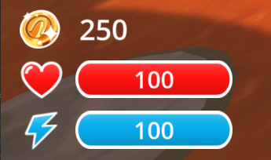
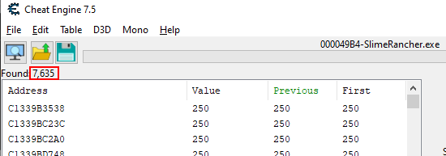
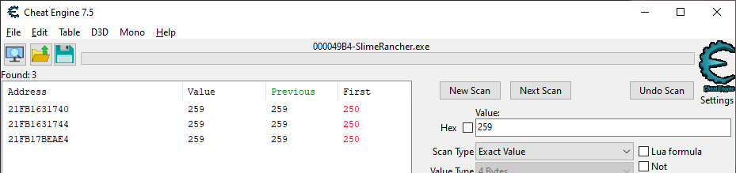
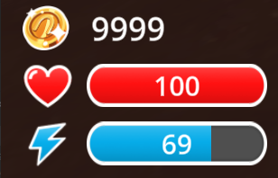

# Finding values with Cheat Engine

When hacking a game, the first step is to find the values you want to manipulate. This can be anything from the player's health, to the number of coins, to the position of an enemy. In this section, we will cover how to find these values using Cheat Engine.

> [!TIP]
> Make sure the Slime Rancher demo is started, and Cheat Engine is running and attached to the process before proceeding. Start a new game to make sure you have the same initial values as we do.

## Memory scanning

### Coin count

For our first example, we will attempt to modify the number of coins we currently have. The game has a counter shown in the bottom-left corner of the screen. Let's find the memory address that stores this value.

 
*This screenshot of the Slime Rancher demo shows the coin counter above the health bar. The value we want to get is going to be 250 (the initial money we get when starting a new game).*

Now that we have a value to search for, the first step is to identify the type of value we are looking for. In this case, 250 is a small number that would fit into a single byte, but it's likely that the game uses a bigger data type to store this value, because it's a counter that can go up to thousands and more.

Determining the type of the value we are looking for can be a little bit tricky, so here are some general guidelines:
- If the value can be either "on" or "off", like a switch, it's likely a boolean. Booleans are usually stored as a single byte, that can be either 0 (*off*, known as "false") or 1 (*on*, known as "true").
- If the value can only be a round number, like 3 or -1407, it's likely an integer. The most commonly used type to store integers is a 4-byte integer. If it can be extremely large (in the scale of billions or more), it will probably be an 8-byte integer. You may also find 2-byte integers or just single bytes to store this kind of values, but this is less common, even when the value is always small.
- If the value can be a decimal number, like 3.14 or -100.5, it's likely a float. You may also find 8-byte floats, more commonly called "doubles", used when the values may be particularly big or precise (meaning they have many decimal places). Floats are also frequently used for percentages, or values that can be computed with fractions like damage values or health values. If your value is displayed in a gauge or a bar, it's likely a float, even if the numbers are shown as rounded numbers in the UI.
- If the value is a text, like "Hello", it's a string. Strings are sequences of characters. They are a bit more complex, and out of scope for this basics guide.

In our case, the coin count is an integer for sure, because we cannot have a fraction of a coin, so it wouldn't make sense to use float or double. Looking for a **4-byte integer** is a good guess, because it's the most commonly used type for integers.

Next, we are going to perform a **first scan**. This is the most basic type of scan, and it's the one you will use most often. It will search the memory for all the values that match the type and value you specify.

In our case, we are looking for a 4-byte integer, with the value of 250. Here's how to do it:
- In the main window of Cheat Engine, locate the scan panel on the right
- In the "Value" field, type `250`
- In the "Scan type" dropdown, select `Exact value`
- In the "Value type" dropdown, select `4 Bytes`
- Click the "First scan" button

 

What this does is search the whole memory of the game for any groups of 4 bytes that have the value 250 when read as an integer.

After the scan is complete, the left panel will fill up with a list of memory addresses that match the value you searched for. For each result, Cheat Engine will show the address, the current value at that address, and the previous/first value at that address (more on that later).

Now, because there are so many bytes in memory (remember, there's more than a billion), the value `250` that we are searching for is inevitably going to show up thousands of times, and not only for our coin counter. Each row in the results panel is a different memory address of a group of 4-bytes that represents an integer value of `250`.

 
*We have more than 7000 results for the value 250. This is expected.*

These thousands of results are too many to look through manually. We need to narrow down the search. To do this, we need to make the game change the value, and then filter out the memory addresses that did not change to the expected new value.

If you went through the game's tutorial (as you should have!), you know how to gain some money. Just collect a plort, shove it into the plort market, and you should obtain some more coins. In my case, I got 9 coins, so I have 259 coins.

Now we can go back to Cheat Engine, enter the value `259` (or however many coins you have now), and hit **next scan**. Remember that "Next scan" is used to filter the results of a previous scan, based on the new value you specify, while "New Scan" or "First scan" will perform an entirely new search.

In the results list:
- The **Address** column shows the memory address where the matching value was found.
- The **Value** column shows the current value at the address, updated in real-time. When the value changes, it is highlighted in red.
- The **Previous** column shows the value the last time we clicked the "Next scan" button.
- The **First** column shows the value at the time of the first scan. In our case, it should be "250" for all results.

After the second scan, you should have a much smaller list of results. If you still have some results that are changing (highlighted in red) despite your coin count staying the same, you can perform additional scans without changing the value to filter them out, or remove them from the list manually.

For this particular value, we should be able to narrow it down to 3 values pretty quickly with only a couple of scans, but it's not uncommon to have to repeat the operation (make the game change the value & scan for the new expected value) a few more times to get to a manageable results count.

 
*The addresses you obtain can be different from the ones shown in this screenshot. This is expected, we will cover this some more later.*

In the results list, you can double-click on an address to add it to the bottom panel. You can also select multiple results and click the little red arrow on the bottom-right of the results panel. The bottom panel is called the **address list**, and it's where you can keep track of the addresses you are interested in.

Once you have added all of your narrowed-down results to the address list, we have to find out which of the three is the correct one. The most straightforward way to do this is to change the value and see if the coin count changes in the game. To do this, double-click on the value in the address list, enter a different value (e.g. `9999`), confirm, and check back in-game.

In my case, modifying the second result seems to have no effect in-game, modifying the third one seems to instantly revert it back to 259, but modifying the first one does the trick. The coin count in the game is now 9999.

 

Congratulations! You have successfully found and modified a value in memory, and the game now believes you have 9999 coins. In fact, unless the game specifically guards against memory hacking (which Slime Rancher and most single-player-only games do not), it has no reason to get suspicious about our sudden fortune, and so it will let us use these coins however we want, no matter how ridiculously high we set the value.

> [!WARNING]
> _Reminder:_ what we are doing here is fine because it's a single-player game, with no competitive aspect. **Using memory hacking for cheating in online games or to gain any kind of advantage (no matter how small) in a competitive space is wrong and will get you banned**. Always respect the rules of the games you play. Keep it fair and don't ruin the fun for others. **If you ignore this, I will do my best to shut down your project.**

Editing values in the memory of your target is the core of memory hacking. Libraries like MindControl will help you automate the writing process, but you will still have to manually find the addresses.

### Bonus training: hacking your health points

As a bonus, try to find and modify your health points using the same technique. Here are a few hints to help you get started:
- You can lose health points by colliding with aggressive slimes in some areas of the game.
- Despite the game showing integral values for health points, remember that most games use floats to store values that show up in gauges or bars.
- Setting your health above 100 will revert it back to 100. This is a common behavior in games to prevent players from healing above the maximum health. Try setting it to a distinct value below 100 to see if it works.

### Bonus bonus training: track a global statistic

As a second bonus, try to find out the memory address that holds one of the following global stats (they don't reset when you start a new game):
- Total number of splorts sold
- Total money made from splorts
- Total number of chicken fed to slimes

> [!TIP]
> These stats are tracked in the achievement menu, but the challenge is to find them without looking. You can look in the achievement menu once you've found them to verify that you have the correct numbers.

A few hints:
- You probably haven't counted how many times you have done these things until now. In these cases, you can use the "Unknown initial value" scan type to get started.
- Once you have an initial scan, you can filter out unwanted addresses by increasing these numbers, and then using the "Increased value by..." scan type, specifying a value that represents by how much you have increased the counter since the last scan. For example, for the splorts sold counter, if you've sold 2 additional splorts since the last scan, specify 2. This will only keep addresses that have increased by that amount since the last scan.

## Next part

In the next section, we will point out a big issue with the technique we just used, and find out how to solve it using pointers.
