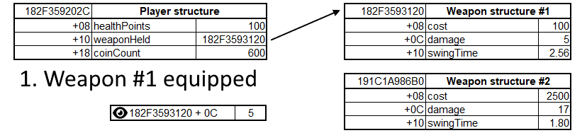
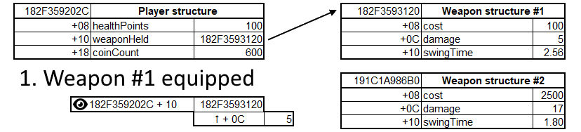
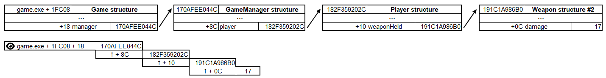

# Unstable addresses

In the previous section, we learned how to find a memory address that stores a specific value. We found the address that stores the coin count in the Slime Rancher demo, and we changed it to a different value. This is a very basic form of memory hacking, but it's already quite powerful. However, there is a catch.

## The issue

With the address of the coin count still in the address list in Cheat Engine, try to go back to the main menu of the game, and then start a new game. You will notice that the value at this address doesn't change. It's stuck with the same old value, and won't reflect the coin count in our new game.

Worse, if you exit the demo (close it entirely) and then start it back up and load into a new game (don't forget to re-attach to the game in Cheat Engine every time you do that!), the address will either be invalid (the value will show up as `??`), or it will hold a value that doesn't have anything to do with the coin count.

If you try to find the address again using the same technique we used in the previous section, you will notice that it's not the same as before. It's a different address.

**Why is that?**

Programs manipulate structures in memory all the time. They allocate memory for variables, use it, and then deallocate it. They move things around, they change the size of structures, they create new structures, and they destroy them. This is all part of the normal operation of a program.

When a program does this, the memory addresses that we found before can be discarded or reused for other purposes. The address that holds the coin count is now different because the memory of the game has been shuffled around when we started a new game or booted up the game again. This is why we call these addresses **unstable**.

To solve this issue, we need to understand two key concepts: **structures** and **pointers**.

## Understanding structures

A structure is a set of variables that are grouped together under a single name. Each variable in the structure is called a member. If you think about it in terms of object-oriented programming, a structure is like a class, and a member is like a field. Members are always organized in the same order across different structures of the same type, and will always be of the same length.

Let's take some examples and define the following two structures (these are simplified examples, not actual structures in Slime Rancher or any other game):

*The `Player` structure*

| Field        | Type       | Offset |
|--------------|------------|--------|
| healthPoints | float      | 0x08   |
| weaponHeld   | pointer    | 0x10   |
| coinCount    | 4-byte int | 0x18   |

*The `Weapon` structure*

| Field     | Type       | Offset |
|-----------|------------|--------|
| cost      | 4-byte int | 0x08   |
| damage    | 4-byte int | 0x0C   |
| swingTime | float      | 0x10   |

In these tables, the `Offset` column tells us where the field is located within the structure. For example, if we know the address of a `Player` structure, we can find the `coinCount` field by adding `0x18` (hexadecimal notation for the number `24`) to the address, no matter where the `Player` structure itself is located. Doing a little bit of math, if we know our `Player` structure starts at the address `182F359202C`, the `coinCount` member will be at the address `182F3592034`.

Now, you'll notice that the `weaponHeld` member is a pointer, which is the second concept we need to understand to solve our issue.

## Understanding pointers

### What is a pointer?

A pointer is simply a variable that holds the address of another variable. It's like a note that says "the value you are looking for is at this address". In our examples, the `weaponHeld` member of the `Player` structure is a pointer to a `Weapon` structure. This means that the `weaponHeld` member holds the address of a `Weapon` structure, and not the `Weapon` structure itself.

Looking at the offsets and value types, we can see that a `Weapon` structure is 24 bytes long. Regardless of that, the `Player` structure can have a `weaponHeld` member that is always 8 bytes long, because it only holds the address of the `Weapon` structure. The `Weapon` structure itself can be located anywhere else in memory.

### How do pointers solve our issue?

Let's take a look back at our "weapon held" example. Say we want to track our current weapon damage. We have found that the address of the `Weapon` structure for the weapon we are currently holding is `182F3593120`. Using the offset, we know that the damage value is at `182F359312C`. Now imagine that, in game, we equip a different weapon.

What happens in that case is that the game will update the value of the `weaponHeld` member in our `Player` structure to hold the address of the new weapon structure (this can also be called "pointing to" the new weapon structure). The previously held `Weapon` structure will not be touched.

When we look at our `182F359312C` address, we still see the same damage value as before, because it still is a field within the old `Weapon` structure. Even worse, if it doesn't need the old weapon anymore, maybe the game will discard the old structure, and the address may become invalid, or be reused to hold different data.

 
*We observe the same address, regardless of the change, so we still get the same value of 5 after the weapon changes.*

Now, let's say that instead of having a fixed `182F359312C` address that we watch, we first read the address of the `weaponHeld` member in the `Player` structure, to know where the weapon structure is stored. Then, we can add the `damage` member offset (`+C`) to that address, and we will always get the correct damage value, no matter how many times the game moves things around in memory.

 
*We observe the pointer to the equipped weapon, and follow it with an added +0C offset to get to the damage value. This time, we get the correct value of 17 after the weapon changes.*

The thing is, the `Player` structure itself can move around, especially if we do things like going back to the menu and loading back in, or even worse, close the game and start it back again. So, following the same logic, we have to find a pointer within a different structure that holds the address of the `Player` structure. Maybe there's a `GameManager` structure that has a `player` pointer member. And then maybe there's a `Game` structure that has a `gameManager` pointer member. And maybe that `GameManager` structure is always located at the same address, relative to a module (more on that later).

If we can figure out this whole chain, we can follow the pointer path:
> `Game` structure address + `gameManager` member offset → `GameManager` structure address + `player` member offset → `Player` structure address + `weaponHeld` member offset → weapon structure address + `damage` member offset

And that pointer path would always be stable, meaning that no matter how much the game moves things around in memory, and no matter how many times we restart the game, we can always get to the `damage` member of the weapon we are holding.

 
*We observe the stable address `game.exe + 1FC08` (we'll learn more about these in the next section) that starts a sequence of pointers, that we follow with known offsets added each time, to finally get to the damage value of the weapon held by the player.*

The key to these pointer paths is to find the first address in the chain that never moves around. This is called a **stable address**.

## Next part

In the next section, we will learn techniques to find stable addresses and follow pointer paths to get to the values we want to read or write. This will allow us to build memory hacking programs that are robust and reliable, even when the game moves things around in memory.
