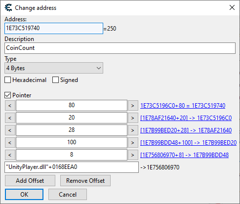

# Understanding pointer paths

Most methods in the `ProcessMemory` class that accept an address also accept a pointer path. A pointer path is a string that describes a sequence of memory addresses and offsets, allowing you to navigate through complex data structures in the target process's memory. More importantly, they allow you to get to the value you want reliably, no matter how the target process shuffles its memory around.

They are usually represented by a string called a pointer path expression. Here is an example of a pointer path expression:

`UnityPlayer.dll+0168EEA0,8,100,28,20,80`

In this example, the pointer path expression consists of:
- `UnityPlayer.dll+0168EEA0`: This is the base address of the module (DLL) in the target process's memory, with an offset of `0168EEA0` bytes.
- `8,100,28,20,80`: These are offsets that will be applied to the base address to navigate through the memory structure. Each number represents an offset in bytes from the previous address.

This expression is the equivalent of the following pointer in Cheat Engine:

<br/>
*To convert a pointer in Cheat Engine to a pointer path expression, read it from bottom to top, separating every field with a comma.*

Pointer paths don't have to be based on modules, they can also be based on pointers. For example, if you have a base pointer address of `0x4A018C30A`, you can create a pointer path like this:

`0x4A018C30A,8,100,28,20,80`

You can also use `+` and `-` operators within pointer paths, e.g.:

`UnityPlayer.dll+0168EEA0,100+8C,28-4,20,80`

## Building pointer paths

Pointer paths can be built in a number of ways:

### Using the expression constructor

```csharp
PointerPath myPath = new PointerPath("UnityPlayer.dll+0168EEA0,8,100,28,20,80");
```

### Using PointerPath.TryParse

Use this method when your pointer path is coming from an external source, such as user input or a configuration file. It will return `null` if the parsing fails, allowing you to handle errors gracefully.

```csharp
var path = PointerPath.TryParse("UnityPlayer.dll+0168EEA0,8,100,28,20,80");
if (path != null)
{
    // Successfully parsed the pointer path
}
else
{
    // Failed to parse the pointer path
}
```

### Using implicit string conversion

This is a convenient way to create a `PointerPath` from a string without using the constructor directly. The string will be parsed automatically.

```csharp
PointerPath myPath = "UnityPlayer.dll+0168EEA0,8,100,28,20,80";
```

This can also be used with any method that accepts a `PointerPath` as an argument:

```csharp
var someValue = processMemory.Read<int>("UnityPlayer.dll+0168EEA0,8,100,28,20,80").ValueOrDefault();
```

> [!NOTE]
> When using pointer string expressions, it's more performant to store and reuse your `PointerPath` instances instead of creating new ones every time you need to read or write memory. This avoids the overhead of parsing the string each time.

### Using the module constructor

This is more performant than the expression constructor, as it does not require parsing the string.

```csharp
PointerPath myPath = new PointerPath("UnityPlayer.dll", 0x168EEA0, 0x8, 0x100, 0x28, 0x20, 0x80);
```

### Using the pointer constructor

This is a variant of the module constructor that allows you to specify the base address as a pointer when your path is not based on a module.

```csharp
PointerPath myPath = new PointerPath(0x4A018C30A, 0x8, 0x100, 0x28, 0x20, 0x80);
```

## Evaluating a pointer path

When using a pointer path for memory manipulations, behind the scenes, MindControl will start by evaluating the pointer path to get the target address out of it. In some cases, you may want to do just that and nothing else. For this, you can use the `EvaluateMemoryAddress` method.

```csharp
UIntPtr address = processMemory.EvaluateMemoryAddress("UnityPlayer.dll+0168EEA0,8,100,28,20,80").ValueOrDefault();
```
