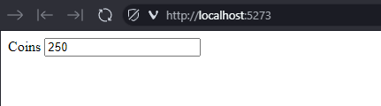
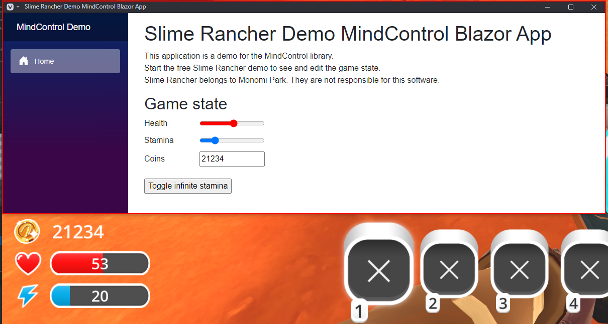

# Setting up MindControl in a Blazor (web) application

This section will guide you through setting up a new Blazor application project that uses the `MindControl` library to interact with the memory of a target process. We will use the Slime Rancher demo (see the [requirements page](../guide-requirements.md) for more info) as our target process, but feel free to use any other target.

## Define the scope of your project

Before we start, let's define what our project should do. In our example, we are going to set up a very simple page, with an editable field for the player's current coin count, with real-time synchronization.

## Create a new Blazor project

First, we need to create a new Blazor application project. There are two types of Blazor applications: Blazor Server and Blazor WebAssembly. Explaining the differences is beyond the scope of this guide, but Blazor server is perfect for our purposes, because it has a built-in mechanism to constantly stream updates from the server app to the browser.

Open a command line interface and navigate to the directory where you want to create the project. Then, run the following command to create your project from scratch:

```bash
dotnet new blazor -n MyMindControlWebProject --empty
cd MyMindControlWebProject
```

> [!NOTE]
> We are using the `dotnet` command-line tool here, but feel free to use your IDE of choice if you prefer.

## Add the MindControl library to your project

Next, we need to add the `MindControl` library to our project. Run the following command to add the library to your project:

```bash
dotnet add package MindControl
```

This will reference the latest stable version of the `MindControl` library in your project using NuGet.

## Develop your memory hacking features in a new class

It's a good idea to separate your memory hacking features from the rest of your application. This way, you can keep your code organized and easy to maintain. Let's create a new class called `SlimeRancherDemo` in a new file called `SlimeRancherDemo.cs`. This class will be our entry point for interacting with the target process, and will define methods for every memory hack our program is able to do.

```csharp
using MindControl;

namespace MyMindControlWebProject;

public class SlimeRancherDemo
{
    // We have determined the memory path to the coin count value in the target process using Cheat Engine. See the tutorials in this guide to learn how to do this.
    private readonly PointerPath _coinCountPath = "UnityPlayer.dll+0168EEA0,8,100,28,20,80";
    
    // Use the name of your target process here.
    private readonly ProcessTracker _processTracker = new("SlimeRancher");
   
    public int? GetCoinCount()
    {
        var process = _processTracker.GetProcessMemory();
        if (process == null)
            return null; // The target process is not running
        
        // Try to read the coin count value from the target process
        var coinCountResult = process.Read<int>(_coinCountPath);
        if (!coinCountResult.IsSuccess)
        {
            // The coin count value could not be read (maybe we are in the main menu)
            // Check coinCountResult.Failure for more information
            return null;
        }
        
        return coinCountResult.Value;
    }
    
    public bool SetCoinCount(int newCoinCount)
    {
        var process = _processTracker.GetProcessMemory();
        if (process == null)
            return false; // The target process is not running
        
        // Try to write the new coin count value to the target process, and return true if successful
        var writeResult = process.Write(_coinCountPath, newCoinCount);
        return writeResult.IsSuccess;
    }
}
```

> [!NOTE]
> In the next chapter of this guide, we will explain how to use the classes and methods provided by `MindControl`. For now, we are just focusing on getting a basic project set up.

As you can see, in our case, we defined two methods: `GetCoinCount` and `SetCoinCount`.

## Register the service in the Program.cs file

Now that we have our memory hacking features defined, we need to register the `SlimeRancherDemo` service in the `Program.cs` file so that we can use it in our Blazor components.

Open the `Program.cs` file and add the following code right before the `builder.Build()` line:

```csharp
// Register the SlimeRancherDemoService as a singleton, so it can be used by multiple pages and components.
builder.Services.AddSingleton<MyMindControlWebProject.SlimeRancherDemo>();
```

## Implementing the page

Now that we have our memory hacking features defined, let's work on the page itself. In Blazor, pages are defined in `.razor` files. The template already has a home page in `Components/Pages/Home.razor`, so let's edit that file to make our page.

```html
@page "/"

@* Specifying the render mode as InteractiveServer allows us to use server-side rendering with interactive components,
which is crucial in our case because the client (the browser) cannot directly access the Slime Rancher game state. *@
@rendermode InteractiveServer

@* We can access the SlimeRancherDemo service using injection because we have registered it in the Program.cs file *@
@inject SlimeRancherDemo _slimeRancherDemo

<PageTitle>Home</PageTitle>

<div class="field">
    <label for="coins">Coins</label>
    <input type="number" value="@_coinCount" id="coins" @oninput="OnCoinsModified" />
</div>

@code {
    public int _coinCount;

    private readonly System.Timers.Timer _stateUpdateTimer = new System.Timers.Timer(TimeSpan.FromMilliseconds(100));
    protected override void OnInitialized()
    {
        _stateUpdateTimer.Elapsed += OnStateUpdateTimerElapsed;
        _stateUpdateTimer.Start();
    }

    /// <summary>Called when the timer ticks, every 100ms.</summary>
    private void OnStateUpdateTimerElapsed(object? sender, System.Timers.ElapsedEventArgs e)
    {
        _coinCount = _slimeRancherDemo.GetCoinCount() ?? 0;

        // Update the UI with StateHasChanged. We need to do that manually when new data comes from events or timers.
        InvokeAsync(StateHasChanged);
    }

    /// <summary>Called when the coin input value is modified manually.</summary>
    private void OnCoinsModified(ChangeEventArgs e)
    {
        // Make sure the input value is a valid number
        if (!int.TryParse(e.Value?.ToString(), out int coins))
            return;

        _slimeRancherDemo.SetCoinCount(coins);
    }
}
```

This code defines a simple page with an input field for the coin count. The input field is bound to the `_coinCount` variable, which is updated every 100 milliseconds by the timer we set up in the `OnInitialized` method.

When the user modifies the input field, the `OnCoinsModified` method is called (through the `oninput` event), which updates the coin count in the game.

At this stage, the program should be complete and functional. You can run it using `dotnet run` from the project directory and try it out.

> [!NOTE]
> You may need to manually access the page in your browser by navigating to the link output by the application after running it, which should look like `http://localhost:5273`.



> Try spending or earning coins in the game, and see how the coin count updates in real-time in your application. You can also change the coin count value in the input field, and it will be reflected in the game.

## Going further

Now, to learn how to use classes and methods provided by the `MindControl` library, check out the [next chapter](../mcfeatures/attaching.md) of this guide.

Alternatively, if you want to see a more advanced example of a Blazor application using the `MindControl` library, check out the [MindControl Blazor app sample](https://github.com/Doublevil/mind-control/tree/main/samples/MindControl.Samples.SrDemoBlazorApp) in the MindControl repository. Here is a breakdown of the features in the sample:
- Fully automated process tracking (process detection with no need for user input, supports the game closing and restarting).
- Editable sliders and input fields, synchronized in real-time with the game, for the player's health, stamina, and coin count values.
- A button to toggle infinite stamina.


