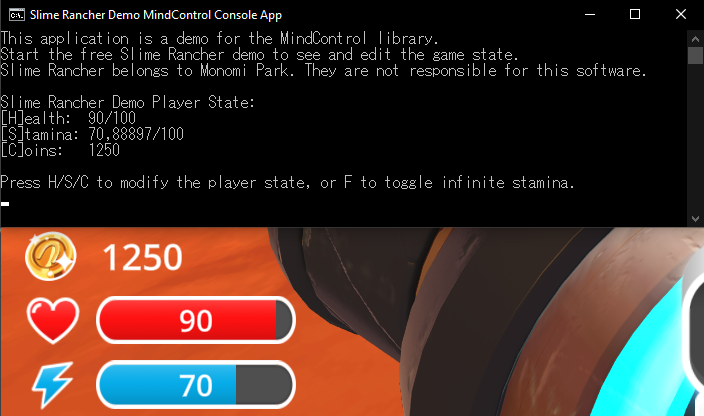

# Setting up MindControl in a console application

This section will guide you through setting up a new console application project that uses the `MindControl` library to interact with the memory of a target process. We will use the Slime Rancher demo (see the [requirements page](../guide-requirements.md) for more info) as our target process, but feel free to use any other target.

## Define the scope of your project

Before we start, let's define what our project should do. In our example, we are going to set up a very simple program that reads the player's current coin count in our target game, and then after pressing a key, we will increment the coin count by 1000.

## Create a new console application project

First, we need to create a new console application project. Open a command line interface and navigate to the directory where you want to create the project. Then, run the following command to create your project from scratch:

```bash
dotnet new console -n MyMindControlProject
cd MyMindControlProject
```

> [!NOTE]
> We are using the `dotnet` command-line tool here, but feel free to use your IDE of choice if you prefer.

## Add the MindControl library to your project

Next, we need to add the `MindControl` library to our project. Run the following command to add the library to your project:

```bash
dotnet add package MindControl
```

This will reference the latest stable version of the `MindControl` library in your project using NuGet.

## Develop your memory hacking features in a new class

It's a good idea to separate your memory hacking features from the rest of your application. This way, you can keep your code organized and easy to maintain. Let's create a new class called `SlimeRancherDemo` in a new file called `SlimeRancherDemo.cs`. This class will be our entry point for interacting with the target process, and will define methods for every memory hack our program is able to do.

```csharp
using MindControl;

namespace MyMindControlProject;

public class SlimeRancherDemo
{
    // We have determined the memory path to the coin count value in the target process using Cheat Engine. See the tutorials in this guide to learn how to do this.
    private readonly PointerPath _coinCountPath = "UnityPlayer.dll+0168EEA0,8,100,28,20,80";
    
    // Use the name of your target process here.
    private readonly ProcessTracker _processTracker = new("SlimeRancher");
   
    public int? GetCoinCount()
    {
        var process = _processTracker.GetProcessMemory();
        if (process == null)
            return null; // The target process is not running
        
        // Try to read the coin count value from the target process
        var coinCountResult = process.Read<int>(_coinCountPath);
        if (!coinCountResult.IsSuccess)
        {
            // The coin count value could not be read (maybe we are in the main menu)
            // Check coinCountResult.Failure for more information
            return null;
        }
        
        return coinCountResult.Value;
    }
    
    public bool SetCoinCount(int newCoinCount)
    {
        var process = _processTracker.GetProcessMemory();
        if (process == null)
            return false; // The target process is not running
        
        // Try to write the new coin count value to the target process, and return true if successful
        var writeResult = process.Write(_coinCountPath, newCoinCount);
        return writeResult.IsSuccess;
    }
}
```

> [!NOTE]
> In the next chapter of this guide, we will explain how to use the classes and methods provided by `MindControl`. For now, we are just focusing on getting a basic project set up.

As you can see, in our case, we defined two methods: `GetCoinCount` and `SetCoinCount`.

## Implement the main program logic

Now that we have our memory hacking features defined, let's implement the main program logic in the `Program.cs` file. This is where we will interact with the `SlimeRancherDemo` class we just created.

```csharp
using MyMindControlProject;

var slimeRancher = new SlimeRancherDemo();
Console.WriteLine("Press any key to read the current coin count.");
Console.ReadKey(true);
int? coinCount = slimeRancher.GetCoinCount();
if (coinCount == null)
{
    Console.WriteLine("Could not read the coin count. Make sure the game is running, and a new game is started.");
    return;
}

Console.WriteLine($"Current coin count: {coinCount}");
Console.WriteLine("Press any key to add 1000 coins.");
Console.ReadKey(true);

bool isWriteSuccessful = slimeRancher.SetCoinCount(coinCount.Value + 1000);
if (!isWriteSuccessful)
{
    Console.WriteLine("Could not write the new coin count. Make sure the game is running, and a new game is started.");
    return;
}
Console.WriteLine("Coin count updated successfully.");
```

This code will read the current coin count from the target process, display it to the user, and then increment the coin count by 1000. Feel free to modify this code to fit your own project.

As of this stage, the program should be complete and functional. You can run it using `dotnet run` from the project directory and try it out.


## Going further

Now, to learn how to use classes and methods provided by the `MindControl` library, check out the [next chapter](../mcfeatures/attaching.md) of this guide.

Alternatively, if you want to see a more advanced example of a console application using the `MindControl` library, check out the [MindControl console app sample](https://github.com/Doublevil/mind-control/tree/main/samples/MindControl.Samples.SrDemoConsoleApp) in the MindControl repository. Here is a breakdown of the features in the sample:
- Fully automatic process tracking (process detection with no need for user input, supports the game closing and restarting, etc).
- A live view of the player's current coin count, health, and stamina values, automatically updated multiple times per second.
- Simple user input to change the player's coin count, health, and stamina values.
- A command to toggle infinite stamina.


