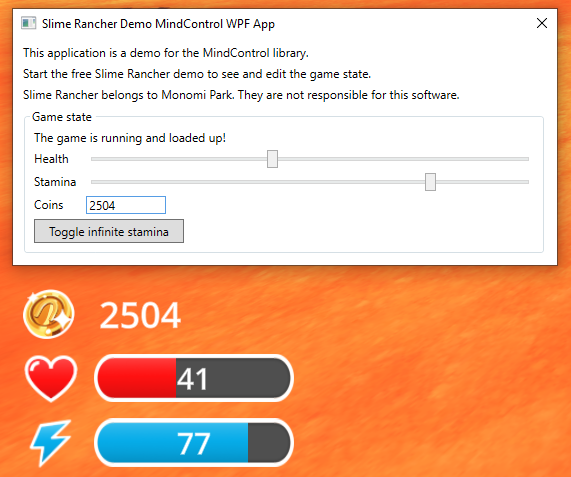

# Creating a MindControl project

In this chapter, we are going to implement a simple example program that uses the `MindControl` library to interact with the memory of our example target process, the Slime Rancher demo.

## Requirements

Before we start, make sure the .net SDK is installed on your system. You can download it from the [official Microsoft .net website](https://dotnet.microsoft.com/en-us/download/dotnet). Pick the latest LTS (Long-Term Support) version. Alternatively, you can use Visual Studio or your .net IDE of choice, which should come with the .net SDK.

To make sure everyone can follow equally, this guide will not assume any particular IDE and use the `dotnet` command-line tool included in the SDK, instead of IDE-specific instructions.

This guide assumes you have a basic understanding of C# programming. If you are new to C#, you can learn in the [official Microsoft C# portal](https://docs.microsoft.com/en-us/dotnet/csharp/).

## What do you want to build?

This guide will show an implementation for multiple different scenarios. It's not necessary to read through them all, just pick the one you are most interested in building.

### Console application

Console apps are the simplest to develop, but also the most limited choice in terms of interface.

**[Follow the Console application implementation guide](./console-setup.md)**

### WPF (desktop) application

WPF apps provide a rich desktop interface that can be customized to your liking.

**[Follow the WPF application implementation guide](./wpf-setup.md)**

### Blazor (web) application

Blazor server apps are web applications. They can be accessed through a web browser, and provide a rich interface that can also be reached from other devices, as long as the server app runs on the same machine as the target process.

**[Follow the Blazor application implementation guide](./blazor-setup.md)**

### Want to build something that isn't listed here?

If you prefer to build a WinForms app, an ASP .net Core web app, a Windows service, or any other type of .net application, you can still follow the general guidelines in [the Console application implementation guide](./console-setup.md). You should be able to adapt the code to your preferred type of application relatively easily.
