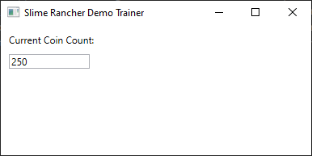
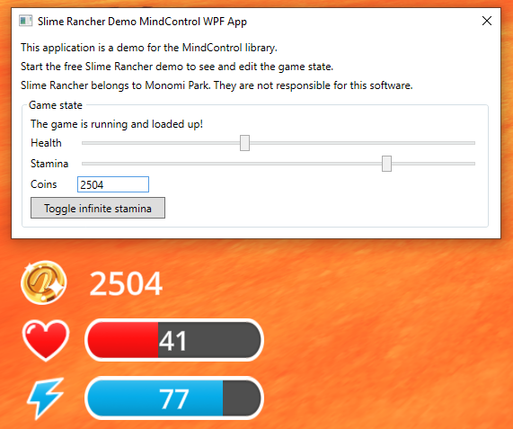

# Setting up MindControl in a WPF application

This section will guide you through setting up a new WPF application project that uses the `MindControl` library to interact with the memory of a target process. We will use the Slime Rancher demo (see the [requirements page](../guide-requirements.md) for more info) as our target process, but feel free to use any other target.

## Define the scope of your project

Before we start, let's define what our project should do. In our example, we are going to set up a very simple window, with an editable field for the player's current coin count, with real-time synchronization.

## Create a new WPF application project

First, we need to create a new console application project. Open a command line interface and navigate to the directory where you want to create the project. Then, run the following command to create your project from scratch:

```bash
dotnet new wpf -n MyMindControlWpfProject
cd MyMindControlWpfProject
```

> [!NOTE]
> We are using the `dotnet` command-line tool here, but feel free to use your IDE of choice if you prefer.

## Add the MindControl library to your project

Next, we need to add the `MindControl` library to our project. Run the following command to add the library to your project:

```bash
dotnet add package MindControl
```

This will reference the latest stable version of the `MindControl` library in your project using NuGet.

## Develop your memory hacking features in a new class

It's a good idea to separate your memory hacking features from the rest of your application. This way, you can keep your code organized and easy to maintain. Let's create a new class called `SlimeRancherDemo` in a new file called `SlimeRancherDemo.cs`. This class will be our entry point for interacting with the target process, and will define methods for every memory hack our program is able to do.

```csharp
using MindControl;

namespace MyMindControlWpfProject;

public class SlimeRancherDemo
{
    // We have determined the memory path to the coin count value in the target process using Cheat Engine. See the tutorials in this guide to learn how to do this.
    private readonly PointerPath _coinCountPath = "UnityPlayer.dll+0168EEA0,8,100,28,20,80";
    
    // Use the name of your target process here.
    private readonly ProcessTracker _processTracker = new("SlimeRancher");
   
    public int? GetCoinCount()
    {
        var process = _processTracker.GetProcessMemory();
        if (process == null)
            return null; // The target process is not running
        
        // Try to read the coin count value from the target process
        var coinCountResult = process.Read<int>(_coinCountPath);
        if (!coinCountResult.IsSuccess)
        {
            // The coin count value could not be read (maybe we are in the main menu)
            // Check coinCountResult.Failure for more information
            return null;
        }
        
        return coinCountResult.Value;
    }
    
    public bool SetCoinCount(int newCoinCount)
    {
        var process = _processTracker.GetProcessMemory();
        if (process == null)
            return false; // The target process is not running
        
        // Try to write the new coin count value to the target process, and return true if successful
        var writeResult = process.Write(_coinCountPath, newCoinCount);
        return writeResult.IsSuccess;
    }
}
```

> [!NOTE]
> In the next chapter of this guide, we will explain how to use the classes and methods provided by `MindControl`. For now, we are just focusing on getting a basic project set up.

As you can see, in our case, we defined two methods: `GetCoinCount` and `SetCoinCount`.

## Implementing the application logic

Now that we have our memory hacking features defined, let's work on the application logic. We are going to use the MVVM (Model-View-ViewModel) pattern to separate our application logic from the user interface. This is a very common pattern in WPF applications, that helps keep the code organized and maintainable.

So let's make a ViewModel that will hold our coin count and update it in real-time. Create a new file called `MainViewModel.cs` in the project directory, and add the following code:

```csharp
using System.ComponentModel;
using System.Runtime.CompilerServices;

namespace MyMindControlWpfProject;

public class MainViewModel : INotifyPropertyChanged
{
    private readonly SlimeRancherDemo _slimeRancherDemo = new();
    
    private int _coinCount;
    public int CoinCount
    {
        get => _coinCount;
        set => SetProperty(ref _coinCount, value);
    }
    
    // We set up a timer to update the displayed game values every 100 milliseconds.
    private readonly System.Timers.Timer _stateUpdateTimer = new(TimeSpan.FromMilliseconds(100));
    
    public MainViewModel()
    {
        _stateUpdateTimer.Elapsed += OnStateUpdateTimerTick;
        _stateUpdateTimer.Start();
    }
    
    /// <summary>Called from the view when the user inputs a new value for the coin count.</summary>
    public void OnCoinCountInput() => _slimeRancherDemo.SetCoinCount(CoinCount);

    /// <summary>Called every time the refresh timer ticks.</summary>
    private void OnStateUpdateTimerTick(object? sender, EventArgs e)
    {
        CoinCount = _slimeRancherDemo.GetCoinCount() ?? 0;
    }
    
    // The code below is boilerplate code for implementing INotifyPropertyChanged.
    // Feel free to move that to a base class if you want to reuse it in other view models.
    public event PropertyChangedEventHandler? PropertyChanged;

    protected void OnPropertyChanged([CallerMemberName] string propertyName = null!)
    {
        PropertyChanged?.Invoke(this, new PropertyChangedEventArgs(propertyName));
    }

    protected bool SetProperty<T>(ref T field, T value, [CallerMemberName] string propertyName = null!)
    {
        if (Equals(field, value))
            return false;
        
        field = value;
        OnPropertyChanged(propertyName);
        return true;
    }
}
```

This is the code that will handle our main window logic. It will update the coin count every 100 milliseconds, and it will also allow the user to input a new coin count value that will be reflected instantly in-game.

## Setting up the user interface

Now, open the `MainWindow.xaml` file and set up the user interface. Here is a simple example of how you can do that:

```xml
<Window x:Class="MyMindControlWpfProject.MainWindow"
        xmlns="http://schemas.microsoft.com/winfx/2006/xaml/presentation"
        xmlns:x="http://schemas.microsoft.com/winfx/2006/xaml"
        Title="Slime Rancher Demo Trainer" Height="200" Width="400">
    <StackPanel Margin="10">
        <TextBlock Text="Current Coin Count:" Margin="0,0,0,10"/>
        <TextBox Text="{Binding CoinCount, UpdateSourceTrigger=PropertyChanged}"
                 Width="100" TextChanged="OnCoinCountInput"/>
    </StackPanel>
</Window>
```

And finally, edit the `MainWindow.xaml.cs` file to set the DataContext to our `MainViewModel` and define the `OnCoinCountInput` method:

```csharp
using System.Windows;
using System.Windows.Controls;

namespace MyMindControlWpfProject;

public partial class MainWindow : Window
{
    private readonly MainViewModel _viewModel;
    
    public MainWindow()
    {
        InitializeComponent();
        _viewModel = new MainViewModel();
        DataContext = _viewModel;
    }

    private void OnCoinCountInput(object sender, TextChangedEventArgs e)
    {
        _viewModel.OnCoinCountInput();
    }
}
```

As of this stage, the program should be complete and functional. You can run it using `dotnet run` from the project directory and try it out.



> Try spending or earning coins in the game, and see how the coin count updates in real-time in your application. You can also change the coin count value in the input field, and it will be reflected in the game.

## Going further

Now, to learn how to use classes and methods provided by the `MindControl` library, check out the [next chapter](../mcfeatures/attaching.md) of this guide.

Alternatively, if you want to see a more advanced example of a WPF application using the `MindControl` library, check out the [MindControl WPF app sample](https://github.com/Doublevil/mind-control/tree/main/samples/MindControl.Samples.SrDemoWpfApp) in the MindControl repository. Here is a breakdown of the features in the sample:
- Fully automated process tracking (process detection with no need for user input, supports the game closing and restarting, tracks when in the main menu).
- Editable sliders and input fields, synchronized in real-time with the game, for the player's health, stamina, and coin count values.
- A button to toggle infinite stamina.


